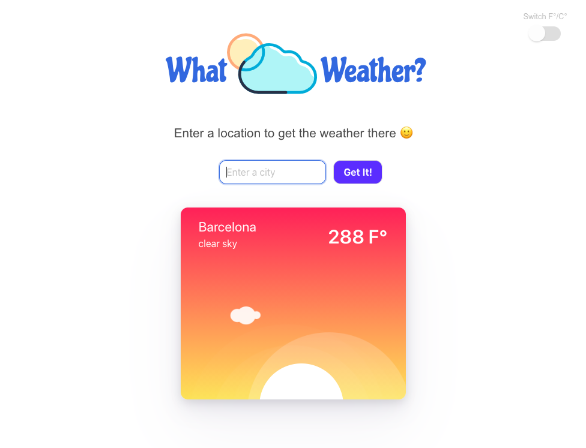

# Weather App JS

A web app that fetches and displays information about the current weather in any of the world's major cities.

The purpose of this project is to demonstrate competence in fetching and handling data via an API - in this case, the [OpenWeatherMap](https://openweathermap.org/) API.

Retrieving the weather data also involves the use of Asynchronous JavaScript, to ensure the proper ordering and execution of tasks.

## Live Demo
To quickly see the project in action, check the [Live Demo](http://raw.githack.com/m15e/weather-app-js/development/dist/index.html).

## Built With

- JavaScript
- npm (Node Package Manager)
- webpack
- Sass
- Bootstrap
- Font Awesome
- [CSS Toggle Switch](https://github.com/ghinda/css-toggle-switch)

## Getting Started

To get a local copy up and running follow these simple example steps:

### Prerequisites

### Setup

To set this project up locally, follow these simple instructions:

1. Open a Terminal and navigate to the location in your system where you would like to download the project. **New to Terminal? [Learn here](https://www.freecodecamp.org/news/conquering-the-command-line-f85f5e46c07c/).**

2. Enter the following line of code to clone this repository:

`git clone git@github.com:m15e/weather-app-js.git`

3. Now that the repository has been cloned, navigate inside it using `cd weather-app-js`.

4. The project's dependencies are managed by npm. To install them, enter the following line of code in the Terminal.

`npm install`

5. Congratulations! All necessary files have been installed. To view the website, just open 'dist/index.html' in a browser of your choosing.

## Author

👤 **Mark Rode**

- Github: [@m15e](https://github.com/m15e)

## 🤝 Contributing

Contributions, issues and feature requests are welcome!

Feel free to check the [issues page](issues/).

## Show your support

Give a ⭐️ if you like this project!

## Acknowledgments

- Animation Design: [author: @vai0](https://github.com/vai0/alarmclockweather_animations) 
- Many thanks to all of my peers and colleagues from Microverse.
- This assignment was taken from [The Odin Project](https://www.theodinproject.com/home)'s Web Development course, which is available for free.
- This project depends on information served by two APIs: [OpenWeatherMap](https://openweathermap.org/) and [Colr](http://www.colr.org).

## 📝 License

This project is [MIT](lic.url) licensed.
